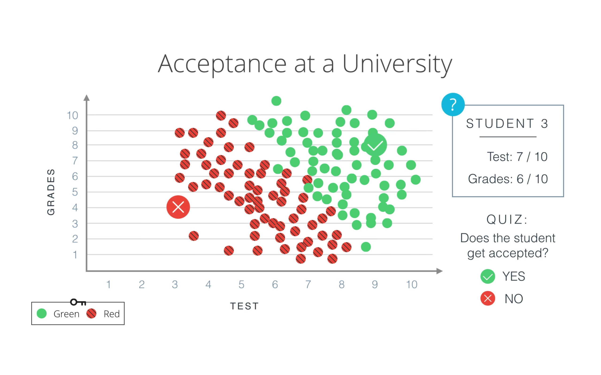
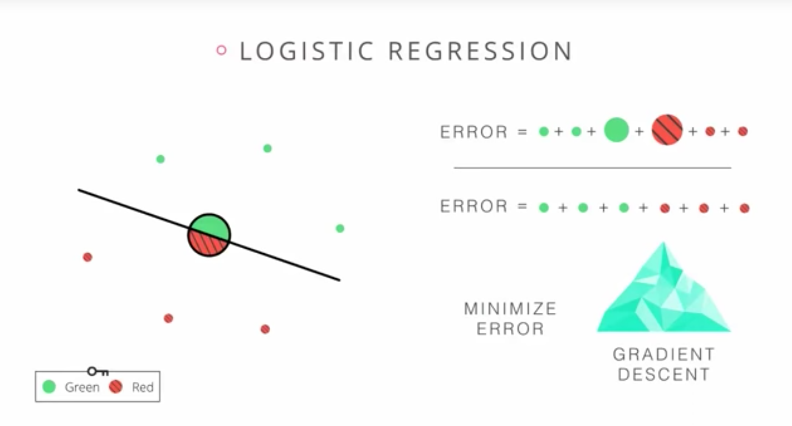
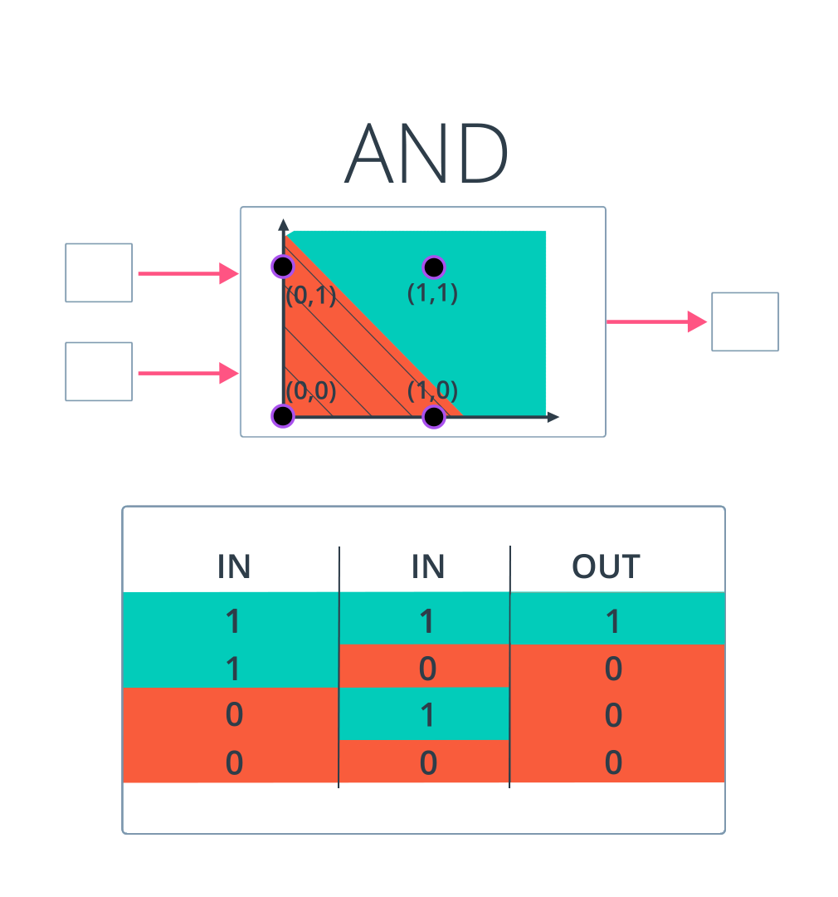
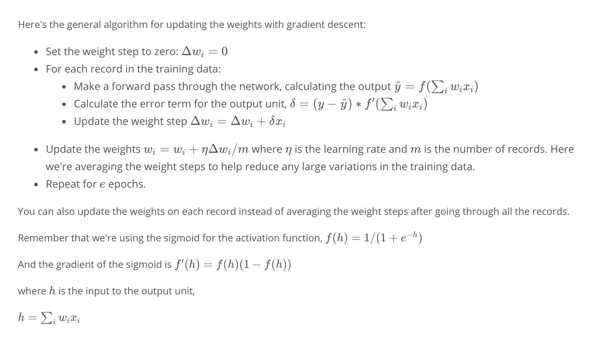
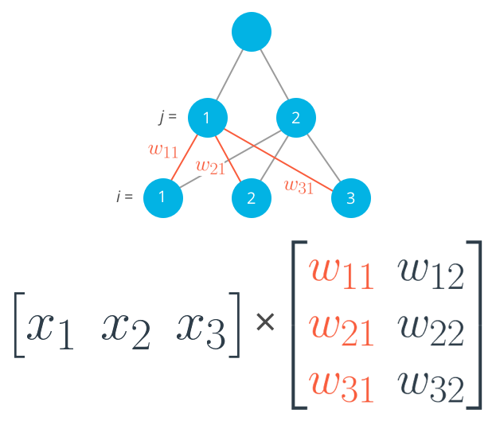
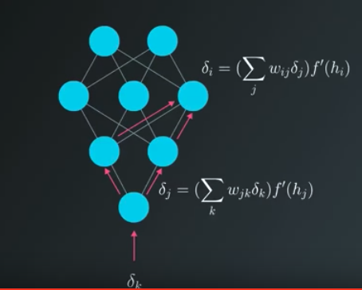
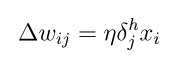

# deep-learning-getting-started
BGL Developer Internal Training Project

Every equation in the book, the readership would be halved
[<A Brief History of Time>](https://en.wikipedia.org/wiki/A_Brief_History_of_Time)

##How would you going to implement it?
If?
Thousands of if?
100 thousands of if?


##Brain

##What makes you and me
Kids brain formed, 3 or 8 years old we got the highest neural in our head

##If we'd like to save our brain, what format is it going to have?
Text?
Pictures?
Videos

##What dose weights means






[Source for And Preceptron](one_perceptron_and.py)

##How to find the right weights


##Expend weights to multiple level



```python
hidden_layer_input = np.dot(x, weights_input_hidden)
hidden_layer_output = sigmoid(hidden_layer_input)

output_layer_in = np.dot(hidden_layer_output, weights_hidden_output)
output = sigmoid(output_layer_in)
```

##Back propagation
To update the weights to hidden layers using gradient descent, you need to know how much error each of the hidden units contributed to the final output. Since the output of a layer is determined by the weights between layers, the error resulting from units is scaled by the weights going forward through the network. Since we know the error at the output, we can use the weights to work backwards to hidden layers.




```python
error = target - output

output_error_term = error * output * (1 - output)

hidden_error_term = np.dot(output_error_term, weights_hidden_output) * \
                    hidden_layer_output * (1 - hidden_layer_output)

delta_w_h_o = learnrate * output_error_term * hidden_layer_output

delta_w_i_h = learnrate * hidden_error_term * x[:, None]
```


##Neural Network Structure
A Neural Network have to have a training and prediction process, we make two method
```python
def train(x, y):
    pass
    
def predict(x):
    y = None
    return y
```

###Node
```python
def sigma_summation(x, weights):
    sum([xi + wi for xi in x for wi in weights])
```

####Activation Functions
we have many activation functions, but only two things we really care about which is 
equation and derivation

You can [view activation functions here](https://en.wikipedia.org/wiki/Activation_function)

```python
class ActivationFunc(object:
    def __init__(name, equation, derivation):
        pass
```

###Training Process
1. Init weights
```python
def initilise_weights():
    pass
```